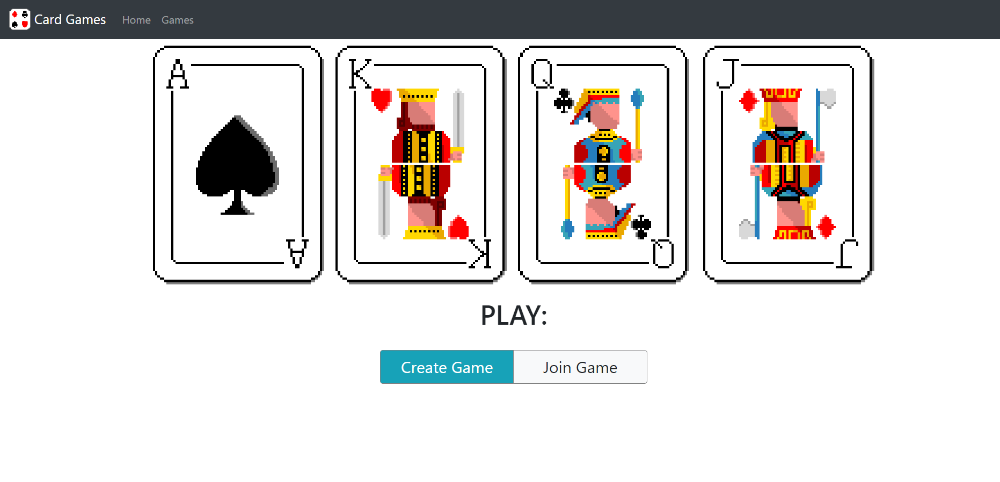

# Card Games
https://card-games-tcc.herokuapp.com/

Build:  

Server:   
    
  

## Front End
- React
- React Bootstrap
- Redux

## Backend
- Spring Boot
- H2 in memory database

## Testing
- Jest & Enzyme for front-end unit testing
- Rest Assured for API integration testing
- Cypress for end to end testing
